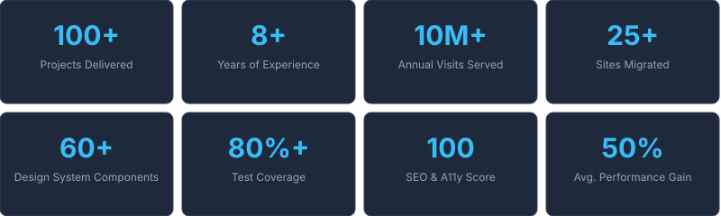

<!-- HEADER -->

  

  &nbsp;
  &nbsp;
  &nbsp;
  

 

---

## 🚀 About Me

💻 **Senior Full-Stack Software Engineer with 8+ years of experience** building scalable web applications.

I build end-to-end web platforms using **React, Next.js, Node.js and TypeScript** — from performant frontend interfaces to scalable REST APIs and GraphQL services, with a focus on clean architecture, system design, maintainability and developer experience. Comfortable across the stack as a **Frontend Developer, Backend Developer and AI Engineer**, integrating LLM APIs (Claude, OpenAI, Groq) into production products, with CI/CD pipelines via GitHub Actions and a strong focus on web accessibility (a11y).

 

<table width="100%">
  <tr>
    <td align="center">🎨</td>
    <td>Frontend architecture, <b>Design Systems</b> and component-driven development</td>
  </tr>
  <tr>
    <td align="center">⚙️</td>
    <td>REST APIs & GraphQL services with <b>Node.js and NestJS</b> — authentication, authorization, modular architecture and clean code patterns</td>
  </tr>
  <tr>
    <td align="center">🗄️</td>
    <td>Database design with <b>PostgreSQL, MongoDB and Redis</b> — schema modeling, migrations and query optimization via Prisma ORM</td>
  </tr>
  <tr>
    <td align="center">⚡</td>
    <td>Performance engineering — <b>Core Web Vitals</b>, LCP, CLS and FCP optimization</td>
  </tr>
  <tr>
    <td align="center">🏗</td>
    <td>Led frontend architecture across <b>multi-brand, multi-tenant platforms</b></td>
  </tr>
  <tr>
    <td align="center">🤖</td>
    <td>AI-powered product development with <b>Claude, Groq and OpenAI</b> APIs</td>
  </tr>
  <tr>
    <td align="center">🔍</td>
    <td>Technical SEO, <b>automated performance auditing</b> and web analytics</td>
  </tr>
  <tr>
    <td align="center">🧪</td>
    <td>Quality engineering — comprehensive <b>unit, integration and E2E</b> test suites</td>
  </tr>
</table>

 

🎓 Software Engineering Specialist — UNICAMP &nbsp;|&nbsp; 🌎 Based in Brazil — Open to **remote opportunities**

---

## ⚡ By the Numbers

 

  

 

---

## ⚙️ Tech Stack

**Frontend**

  

**Backend & Data**

  

**Cloud & Tooling**

  

 

- **Languages:** TypeScript, JavaScript
- **Frontend:** React, Next.js, Redux, Tailwind CSS, Vite, Jest, Storybook, Design Systems
- **Backend:** Node.js, NestJS, REST APIs, GraphQL, Prisma
- **Data:** PostgreSQL, MongoDB, Redis
- **AI:** Claude API, OpenAI API, Groq API (Llama), AI-powered applications
- **Cloud & DevOps:** AWS, Vercel, Docker, Git, GitHub Actions, CI/CD, Linux

---

## 🚀 Featured Projects

<b>🎨 Design System — Component Library & Token Architecture</b> &nbsp;<code>TypeScript</code> <code>React</code> <code>Storybook</code> <code>Next.js</code>

 

> Enterprise-grade monorepo for scalable UI development across multi-brand platforms.

Built a production-ready design system from the ground up — **50 React components** organized by atomic design principles, paired with **9 fully interchangeable theme sets** driven by CSS Custom Properties. Shipped with live Storybook docs and a Next.js showcase app for interactive exploration.

 

| | |
|:---:|:---|
| 📦 | 50 production-ready components spanning atoms, molecules and organisms |
| 🎨 | 9 design token themes — zero-runtime, swapped with a single HTML attribute |
| 🔷 | Fully typed component API with prop autocomplete and strict variant enforcement |
| 📚 | Live Storybook with interactive controls and accessibility checks built in |

 

 

<b>🌐 Next Portfolio — AI-Enhanced Full-Stack Showcase</b> &nbsp;<code>Next.js 15</code> <code>Groq AI</code> <code>Supabase</code> <code>TypeScript</code>

 

> 99 PageSpeed score on mobile. AI chatbot. Bilingual. Built to impress.

A production-grade developer portfolio built as a technical statement in itself. Integrated a **Groq AI chatbot** that answers questions about my experience in real time, dynamic content via Supabase, bilingual routing (EN/PT-BR) and scored **99 on PageSpeed mobile** — Core Web Vitals green tier across the board.

 

| | |
|:---:|:---|
| ⚡ | 99 PageSpeed mobile — fully green Core Web Vitals |
| 🤖 | AI chatbot powered by Groq answering questions about my stack and experience |
| 🌐 | Bilingual with seamless EN ↔ PT-BR locale switching |
| 🌓 | Dark/light mode with system preference detection and zero layout shift |

 

 

<b>🤖 DevInterviewLab — AI-Powered Interview Prep Platform</b> &nbsp;<code>Next.js</code> <code>Groq AI</code> <code>Supabase</code> <code>TypeScript</code>

 

> Personalized roadmaps, live coding simulator, flash drills — built for engineers, by an engineer.

Full-stack SaaS platform for technical interview preparation with AI at its core. Generates **personalized study roadmaps** by tech stack, curated Q&A banks, live coding sessions with real-time AI hints, and Flash Topics — 5-minute daily drills designed for long-term retention. Fully bilingual (EN/PT).

 

| | |
|:---:|:---|
| 🗺 | AI-generated study roadmaps personalized by tech stack and seniority |
| 💻 | Live coding simulator with contextual hints and solution feedback |
| ⚡ | Flash Topics: bite-sized daily practice for active recall |
| 🌐 | Bilingual platform — seamless EN ↔ PT switching throughout |

 

 

<b>🏛 Philosophia — Interactive Encyclopedia of Philosophy</b> &nbsp;<code>Next.js 14</code> <code>TypeScript</code> <code>AI</code> <code>Tailwind</code>

 

> AI-generated portraits. Isometric scenes. 138-question quiz engine. Because why not.

A bilingual interactive encyclopedia spanning **8 philosophical schools** and **23 philosopher profiles** — complete with AI-generated portrait illustrations, isometric scene compositions, and a 138-question adaptive quiz bank. EN/PT-BR throughout.

 

| | |
|:---:|:---|
| 🎨 | AI-generated portraits with a consistent, editorial visual language across all philosophers |
| 🏙 | Isometric scene illustrations for each philosophical school of thought |
| 🧠 | 138-question quiz bank with contextual scoring and school-of-thought breakdowns |
| 🌐 | 8 philosophical schools, 23 deep-dive profiles — bilingual EN/PT-BR |

 

 

<b>💰 Finanças do Casal — Collaborative Finance PWA with AI Import</b> &nbsp;<code>React</code> <code>Claude AI</code> <code>Supabase</code> <code>Vite</code>

 

> Shared budget dashboard for couples. Paste your bank export — Claude categorizes it for you.

Collaborative personal finance PWA built for two — tracks shared expenses, income, recurring bills, and installments in a unified dashboard. The standout feature: **AI-powered spreadsheet import via Claude Sonnet** — paste raw bank exports and the model parses, cleans, and categorizes every transaction automatically.

 

| | |
|:---:|:---|
| 🤖 | AI-powered import via Claude Sonnet — paste bank data, model parses and categorizes |
| 🔄 | Real-time shared dashboard synced between both partners |
| 📅 | Installment tracking with automatic monthly split-distribution |
| 📱 | PWA — installable on mobile, works offline |

 

 

<b>🔍 AI Code Reviewer — Real-Time Code Quality Analyzer</b> &nbsp;<code>React</code> <code>TypeScript</code> <code>Groq AI</code> <code>Vite</code>

 

> Paste your code. Get a score, issues with fixes, and a refactored version — all streamed in real time.

An AI-powered code review tool built for developers who want instant, actionable feedback. Paste any snippet and the model returns a **quality score from 0 to 100**, a list of issues with concrete fix suggestions, and a fully refactored version of the code — all streamed token by token via Groq's Llama 4.

 

| | |
|:---:|:---|
| 📊 | Quality score 0–100 with breakdown by category |
| 🐛 | Detailed issue list with concrete, copy-paste fix suggestions |
| ✨ | AI-refactored version of the submitted code |
| ⚡ | Real-time streaming output via Groq API (Llama 4) |

 

 

<b>🗂 Interview Command Center — AI-Powered Job Search CRM</b> &nbsp;<code>React</code> <code>Claude API</code> <code>Supabase</code> <code>TypeScript</code>

 

> A personal CRM for job hunting — track every interview stage, let AI draft your recruiter replies.

Personal CRM built to manage job interview pipelines end-to-end. Uses the **Claude API** to generate recruiter responses and adapt CVs per opportunity, backed by Supabase for real-time pipeline and stage tracking.

 

| | |
|:---:|:---|
| 🤖 | AI-generated recruiter responses and CV adaptation via Claude API |
| 📋 | Full pipeline tracking across every interview stage |
| 🔄 | Real-time data sync powered by Supabase |
| ⚛️ | Built with React and TypeScript |

 

 

<b>🏯 Philosophia Oriental — Eastern Philosophy Encyclopedia</b> &nbsp;<code>Next.js</code> <code>TypeScript</code> <code>AI</code> <code>Tailwind</code>

 

> The Eastern-philosophy companion to Philosophia — same AI-driven visual language, new schools of thought.

Companion project to Philosophia, extending the interactive encyclopedia format to Eastern philosophical traditions, with the same bilingual (EN/PT-BR), AI-assisted illustration pipeline built on Next.js and TypeScript.

 

| | |
|:---:|:---|
| 🏯 | Interactive encyclopedia focused on Eastern philosophical schools |
| 🎨 | AI-generated illustrations consistent with the Philosophia visual language |
| 🌐 | Bilingual EN / PT-BR content |
| 🔷 | Built with Next.js and TypeScript |

 

---

## 📊 GitHub Stats

  

Métricas geradas automaticamente via GitHub Actions (<code>.github/workflows/metrics.yml</code>) — SVG estático, sem depender de serviços de terceiros ao vivo.

---

## 📈 Activity Graph

  

---

## 🐍 Contribution Snake

  

---

## 🌐 Connect With Me

  &nbsp;
  &nbsp;
  

<!-- FOOTER -->

